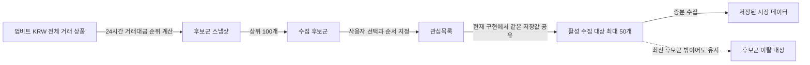

# goodmoneying 도메인 용어집

Status: Draft
Last Updated: 2026-07-10
Related Product: `docs/01_Product.md`
Related Architecture: `docs/02_Architecture.md`
Related Issue: [#9](https://github.com/goodjoon-company/goodmoneying/issues/9)

## 목적

이 문서는 goodmoneying의 제품, 설계, 계약 설명, 코드 리뷰, 사용자 화면에서 사용하는 도메인 용어의 단일 기준(source of truth)이다.

- 표준 용어는 새 문서와 화면 문구에서 우선 사용한다.
- 피할 별칭은 역사 문서 인용이나 기존 API·코드 식별자(identifier)를 설명할 때만 사용한다.
- 영어 이름은 다른 언어의 문서나 코드와 의미를 대조하기 위한 번역이며 기존 식별자의 즉시 변경을 뜻하지 않는다.

## 투자 대상 선택

| 용어(Term) | 정의(Definition) | 피할 별칭(Aliases to avoid) |
|---|---|---|
| 거래 상품(Instrument) | 거래소나 시장에서 실제로 거래되는 단위이며 현재 업비트(Upbit)에서는 `KRW-BTC` 같은 KRW 마켓을 뜻한다. | 종목, 코인, 마켓 코드 |
| 수집 후보군(Collection Candidate Pool) | 사용자가 수집 대상으로 선택할 수 있도록 시스템이 계산한 거래 상품 집합이며 현재 업비트 KRW 마켓의 24시간 거래대금 상위 100개다. | 후보 유니버스, 유니버스, 종목 리스트, 후보 목록 |
| 후보군 스냅샷(Candidate Pool Snapshot) | 특정 산정 시각의 수집 후보군 순위와 거래 상품 구성을 보존한 결과다. | 유니버스 스냅샷, 후보 목록 |
| 후보군 이탈 대상(Out-of-Pool Target) | 활성 수집 대상이지만 최신 수집 후보군에는 포함되지 않아 새 후보와 구분해 표시하는 거래 상품이다. | 유니버스 이탈, 제외 종목 |
| 관심목록(Watchlist) | 사용자가 비교하고 계속 살펴보기 위해 선택하고 순서를 정한 거래 상품 집합이다. | 관심종목 목록, 즐겨찾기, 선택 종목 |
| 관심종목(Watchlist Item) | 관심목록에 포함된 하나의 거래 상품이며 화면 제목에서는 관심목록 전체를 가리키는 이름으로도 사용한다. | 관심 코인, 즐겨찾기 종목 |
| 활성 수집 대상(Active Collection Target) | 수집 워커(Collection Worker)가 현재 증분 수집(Incremental Collection)을 수행하는 거래 상품이며 최대 50개다. | 선택 종목, 수집 목록, 관심목록 |
| 비활성 수집 대상(Inactive Collection Target) | 과거 데이터는 보존하지만 현재 증분 수집은 중단된 거래 상품이다. | 삭제 대상, 제외 종목 |

현재 구현에서는 관심목록과 활성 수집 대상이 `collection_targets`의 같은 거래 상품 식별자와 순서를 공유한다. 두 용어는 저장값이 아니라 사용자 의도와 운영 동작을 각각 설명하므로 의미상 구분한다.

## 시장 데이터

| 용어(Term) | 정의(Definition) | 피할 별칭(Aliases to avoid) |
|---|---|---|
| 캔들(Candle) | 정해진 시간 구간의 시가, 고가, 저가, 종가, 거래량, 거래대금을 나타내는 완성 또는 기준 시점이 있는 시장 데이터다. | OHLCV, 봉 데이터 |
| 원천 캔들(Source Candle) | 외부 데이터 공급원에서 직접 받은 캔들이며 현재 업비트 1분 캔들과 일봉을 뜻한다. | 원본 캔들, 공식 캔들 |
| 파생 캔들(Derived Candle) | 저장된 원천 캔들을 집계해 만든 캔들이며 3분, 5분, 시간, 주, 월 단위 조회에 사용한다. | 집계 캔들, 변환 캔들 |
| 현재가 스냅샷(Ticker Snapshot) | 특정 수집 시점에 관측한 최신 가격, 거래대금, 등락률과 관련 현재가 상태를 나타내는 시장 데이터다. | 티커, 현재가, 실시간 가격 |
| 체결 이벤트(Trade Event) | 거래소에서 하나의 매수·매도 거래가 체결됐음을 가격, 수량, 시각과 함께 나타내는 시장 데이터다. | 체결, 거래 이벤트 |
| 호가 요약(Orderbook Summary) | 특정 수집 시점의 최우선 매수·매도 가격과 수량, 스프레드(Spread), 누적 잔량, 호가 불균형(Imbalance), 수집 지연을 나타내는 요약 시장 데이터다. | 호가, 오더북, 호가 스냅샷 |
| 호가 원천 스냅샷(Source Orderbook Snapshot) | 외부 데이터 공급원에서 받은 호가 단위(Orderbook Unit)를 요약하지 않고 특정 수집 시점 기준으로 보존한 시장 데이터다. | 호가 요약, 호가, 원천 호가 |
| 수집 버킷 시간(Collection Bucket Time) | 시점성 시장 데이터를 정해진 저장 주기로 묶기 위해 사용하는 기준 시간 버킷이며 현재 현재가 스냅샷과 호가 요약을 분 단위로 대표 저장할 때 사용한다. | 수집 시간, 기준 시간, 버킷 |

## 수집 실행과 복구

| 용어(Term) | 정의(Definition) | 피할 별칭(Aliases to avoid) |
|---|---|---|
| 업비트 수집 파이프라인(Upbit Collection Pipeline) | 업비트 KRW 마켓 데이터를 수집·저장하고 품질 확인과 운영 상태 노출까지 책임지는 현재 핵심 경계다. | 시장 데이터 플랫폼, 업비트 모듈 |
| 수집 워커(Collection Worker) | 외부 시장 데이터 공급원에서 데이터를 가져와 저장하고 수집 품질을 기록하는 상시 실행 프로세스다. | 크롤러, 배치, 스케줄러 |
| 운영 서버(Operations Server) | 수집 상태와 저장된 시장 데이터를 조회하도록 API와 운영 화면의 백엔드를 제공하는 프로세스다. | 대시보드 서버, 웹 서버 |
| 수집 계획(Collection Plan) | 거래 상품과 데이터 유형별 목표 기간, 수집 방식, 현재 수집 상태를 정의한 운영 기준이다. | 수집 설정, 계획 |
| 증분 수집(Incremental Collection) | 이미 수집 중인 대상에 대해 새로 완성되거나 관측된 시장 데이터만 이어서 수집하는 방식이다. | 실시간 수집, 정기 수집 |
| 백필(Backfill) | 신규 수집 대상 추가 또는 결측 복구를 위해 과거 시장 데이터를 채우는 수집 방식이다. | 과거 수집, 초기 적재 |
| 백필 계획(Backfill Plan) | 백필 실행 전에 대상, 기간, 예상 요청 수, 저장 예상량을 계산해 사용자가 승인할 수 있게 만든 계획이다. | 백필 미리보기, 실행 계획 |
| 백필 작업(Backfill Job) | 사용자가 승인한 백필 계획을 실제로 실행하고 상태와 진행률을 추적하는 작업이다. | 백필 실행, 백필 태스크 |
| 안전 재시작(Safe Restart) | 기존 데이터를 삭제하지 않고 목표 범위 전체를 재검사해 없는 데이터만 다시 수집하는 백필 작업 재시작 방식이다. | 재시작, 이어서하기 |
| 삭제 후 재수집(Destructive Rebuild) | 목표 범위의 기존 데이터를 삭제한 뒤 다시 수집하는 위험 작업이다. | 초기화, 강제 재수집 |
| 수집 실행(Collection Run) | 특정 데이터 유형과 시점에 대해 수집 워커가 수행한 작업 단위다. | 작업, 배치 실행 |
| 대상별 수집 결과(Target Collection Result) | 하나의 수집 실행 안에서 개별 수집 대상의 성공, 실패, 지연, 결측 상태를 기록한 결과다. | 수집 로그, 결과 로그 |
| 워커 생존 신호(Worker Heartbeat) | 수집 워커가 실행 중이며 최근 작업 상태를 기록했음을 나타내는 시각과 상태 정보다. | heartbeat, 워커 상태 |

## 품질과 운영

| 용어(Term) | 정의(Definition) | 피할 별칭(Aliases to avoid) |
|---|---|---|
| 수집 시도 품질(Collection Attempt Quality) | 수집 시도 자체의 성공, 실패, 응답 지연, 파싱 실패, 저장 실패를 나타내는 품질 관점이다. | 수집 품질, 호출 품질 |
| 데이터 완전성 품질(Data Completeness Quality) | 기대한 시간 구간의 데이터 존재 여부, 중복, 최신성, 무데이터 가능 상태를 나타내는 품질 관점이다. | 데이터 품질, 결측 품질 |
| 수집 진행률(Collection Coverage) | 수집 대상별 데이터 유형이 목표 수집 범위 대비 어느 시점 또는 어느 비율까지 저장됐는지를 나타내는 상태다. | 진행률, 수집률, 백필 상태 |
| 결측 구간(Missing Range) | 목표 수집 범위 안에서 기대한 시장 데이터가 아직 존재하지 않거나 복구가 필요한 시간 구간이다. | 결측, 누락 구간, 빈 구간 |
| 데이터 완전성 검사(Data Completeness Check) | 목표 수집 범위와 저장된 데이터를 비교해 결측 구간을 생성하거나 해결하는 작업이다. | 품질 검사, 무결성 검사 |
| 화면용 뷰 모델(View Model) | 화면이 추가 계산 없이 렌더링하도록 수집 또는 배치 시점에 계산해 저장한 조회 전용 데이터다. | 화면 데이터, 응답 모델 |
| 감사 로그(Audit Log) | 운영 설정, 수집 대상, 백필 제어처럼 데이터 상태에 영향을 주는 쓰기 작업의 행위자, 시각, 대상, 변경 내용을 기록한 이력이다. | 변경 로그, 작업 로그 |
| 알림 이벤트(Notification Event) | 수집 실패, 지연, 결측, 백필 실패처럼 사용자가 확인해야 하는 운영 상태 변화를 제품 안에 표시하기 위해 저장하는 이벤트다. | 알림, 경고 |
| 저장 시각(Storage Time) | 데이터베이스(DB, Database)와 API 계약에서 절대 시각으로 보존하는 기준 시각이다. | 서버 시간, 저장 시간 |
| 표시 시각(Display Time) | 사용자 화면에서 시장 맥락에 맞춰 보여주는 시각이며 업비트 KRW 마켓은 한국 표준시(KST, Korea Standard Time)를 기본으로 한다. | 로컬 시간, 화면 시간 |

## 관계(Relationships)

- 수집 후보군은 시스템이 계산하고 관심목록은 사용자가 선택한다.
- 관심종목은 관심목록의 단일 거래 상품이고 활성 수집 대상은 워커의 실행 관점이다.
- 최초 설정에서는 수집 후보군 상위 50개를 활성 수집 대상으로 둘 수 있지만 이후 사용자는 최대 50개 안에서 선택과 순서를 바꿀 수 있다.
- 기존 활성 수집 대상이 최신 수집 후보군에서 이탈해도 자동 삭제하지 않으며, 새로운 활성 수집 대상은 최신 수집 후보군 안에서 선택한다.
- 호가 요약과 호가 원천 스냅샷은 서로 대체 가능한 이름이 아니라 저장 정밀도가 다른 별도 데이터다.

## 예시 대화(Example Dialogue)

> 기획: “최신 수집 후보군에서 비교할 거래 상품 12개를 관심목록에 넣어 주세요.”
>
> 개발: “현재 구현에서는 그 12개가 같은 순서의 활성 수집 대상이 되어 수집 워커가 증분 수집합니다.”

> 운영: “KRW-ABC는 최신 수집 후보군 밖으로 밀렸지만 기존 활성 수집 대상이므로 후보군 이탈 대상으로 남아 있습니다.”
>
> 개발: “자동 삭제하지 않고 사용자가 관심목록을 변경할 때까지 데이터를 계속 수집합니다.”

> 개발: “제품 문서에서는 수집 후보군이라고 부르지만 기존 `/v1/candidate-universe` 경로와 `CandidateUniverseResponse` 이름은 호환성을 위해 유지합니다.”

## 호환성 별칭(Compatibility Aliases)

| 기존 이름 | 표준 용어 | 유지 범위 |
|---|---|---|
| 후보 유니버스(Candidate Universe) | 수집 후보군(Collection Candidate Pool) | 과거 문서 인용과 기존 API·코드 식별자 설명에만 사용 |
| `/v1/candidate-universe` | 수집 후보군 조회 API | 기존 HTTP 경로를 유지 |
| `CandidateUniverseResponse`, `CandidateUniverseEntry` | 수집 후보군 응답과 항목 | 기존 OpenAPI 스키마(schema)와 코드 형식 이름을 유지 |
| `in_universe`, `out_of_universe` | 후보군 포함, 후보군 이탈 | 기존 API 열거형(enum) 값을 유지 |
| `collection_targets` | 활성 수집 대상 저장소 | 기존 데이터베이스 테이블 이름을 유지 |

## 남은 모호성(Flagged Ambiguities)

| 항목 | 현재 해석 | 결정이 필요한 때 |
|---|---|---|
| 관심목록과 활성 수집 대상의 결합 | 현재는 같은 거래 상품 식별자와 순서를 공유하지만 사용자 의도와 워커 동작을 설명하는 별도 개념이다. | 수집하지 않고 비교만 할 관심종목을 지원할 때 API·DB 계약을 분리한다. |
| 관심종목이라는 화면 제목 | 화면 제목에서는 목록 전체를, 문장 안에서는 목록의 단일 항목을 뜻할 수 있다. | 새 화면 문구를 설계할 때 목록 전체는 관심목록으로 우선 표현한다. |
| 수집 후보군 갱신 주기 | 산정 시각은 후보군 스냅샷에 기록하지만 제품 정책으로 보장할 갱신 주기는 아직 명시하지 않았다. | 사용자에게 최신성 보장을 노출하거나 운영 서비스 수준 목표(SLO, Service Level Objective)를 정할 때 확정한다. |
| 기존 영문 식별자 | 의미는 수집 후보군으로 읽되 기존 경로·스키마·열거형 값은 호환성 때문에 유지한다. | 외부 소비자 영향과 이행 계획을 갖춘 별도 계약 변경에서만 이름 변경을 검토한다. |
