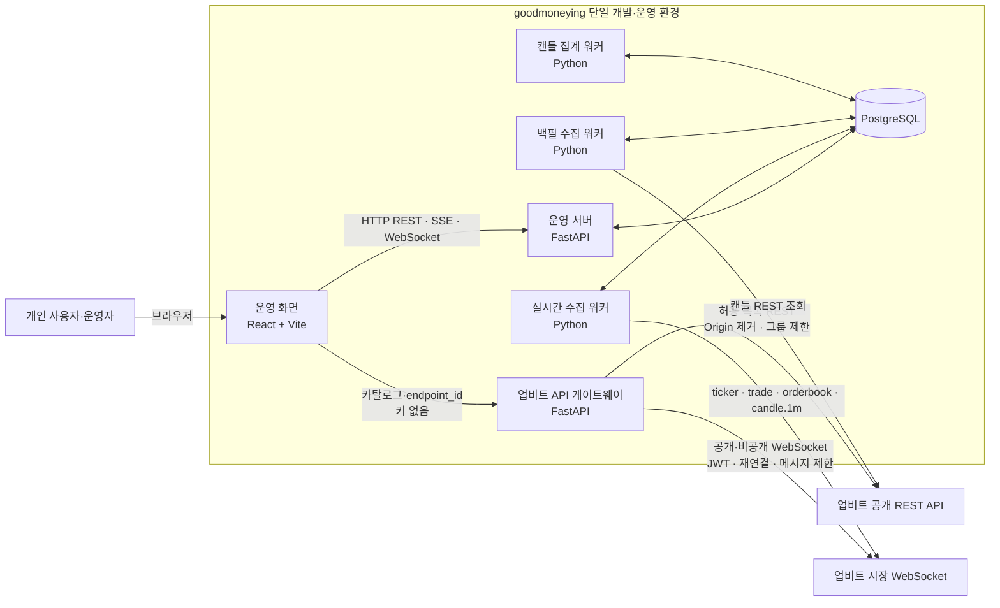
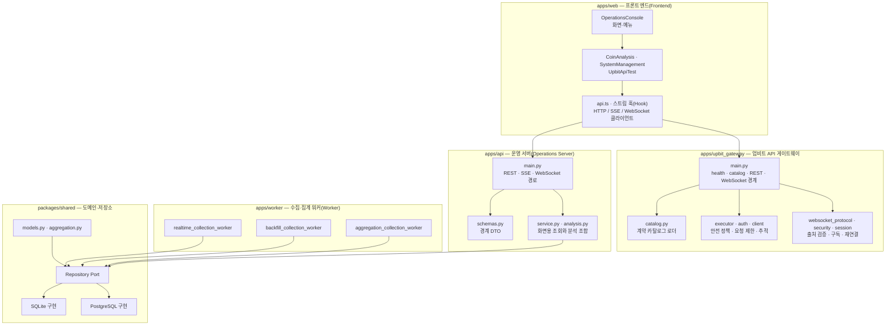
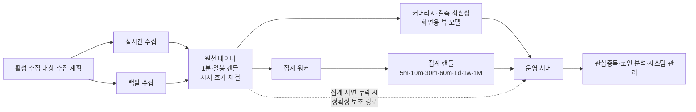
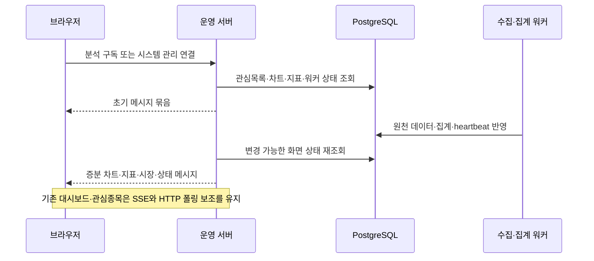

# 아키텍처 개발 사양

Status: Accepted
Last Updated: 2026-07-16

## 문서 역할과 읽는 순서

이 문서는 goodmoneying의 **현재 시스템 경계, 런타임 구성, 모듈 책임, 데이터 흐름**의 단일 기준(source of truth)이다. 제품의 이유와 우선순위는 [제품 개발 사양](01_Product.md), 정확한 DB·HTTP·WebSocket 형식은 [계약 기준](contracts/README.md), 개별 수집 동작은 [업비트 수집 파이프라인 설계](02_Architecture/upbit-collection-pipeline.md)에서 확인한다.

이 문서는 현재 구현을 설명한다. 주식·뉴스·대규모 언어 모델(LLM, Large Language Model)·메시지 큐(Message Queue)·다중 인스턴스는 후보이며 현재 다이어그램의 구성요소가 아니다.

## 설계 목표와 제약

| 목표 | 현재 설계 기준 |
|---|---|
| 분석 가능한 신뢰 데이터 | 업비트 KRW 데이터를 원천 사실과 화면용 상태로 분리해 PostgreSQL에 보존한다. |
| 운영 가능한 단순성 | API와 세 워커는 단일 프로세스·DB 상태 기반 제어를 사용한다. |
| 화면별 전송 효율 | 기존 운영 화면은 SSE(Server-Sent Events)와 HTTP 폴링(Polling) 보조, 분석·시스템 관리는 WebSocket 증분 메시지를 사용한다. |
| 재처리 가능성 | 1분·일봉 원천 캔들을 보존하고, 분석용 시간 단위는 멱등 집계 또는 원천 파생으로 제공한다. |
| 계약 우선 | 외부·브라우저·DB 형식은 코드보다 `docs/contracts/`에서 먼저 정의하고 자동 테스트로 검증한다. |

현재는 개인 단일 사용자와 로컬 신뢰 네트워크를 전제로 한다. 쓰기 API는 운영 토큰(Authentication)을 요구하며, 다중 사용자 권한(Authorization)과 고가용성(High Availability)은 범위 밖이다.

## 시스템 문맥(System Context)

브라우저의 업비트 API 테스트 페이지도 업비트에 직접 연결하지 않는다. 별도 게이트웨이가 키·허용 목록·요청 제한·비파괴 정책 경계를 소유하며 브라우저에는 카탈로그와 마스킹된 추적 정보만 제공한다. 수집·저장·분석의 제품 데이터 경로는 기존 서버 측 워커와 PostgreSQL을 통과한다.

## 소프트웨어 아키텍처(Software Architecture)

`packages/shared`의 저장소 포트(Repository Port)는 API와 세 워커의 공통 경계다. SQLite는 격리 테스트용이며, 실제 개발·운영은 PostgreSQL 구현을 사용한다.

## 런타임 구성요소

| 런타임 | 책임 | 상태·복구 기준 |
|---|---|---|
| 업비트 API 게이트웨이(Upbit API Gateway) | 브라우저 대신 공식 REST·WebSocket을 연결하고 카탈로그·인증·요청 제한·안전 정책·추적을 한 경계에 둔다. | `/health`, `/v1/catalog`, `/v1/requests`, `/v1/websocket`을 제공한다. REST 실행은 운영자 토큰을 검증하고, `read`와 공식 주문 테스트만 상향 호출하며 `blocked`는 자격 증명·제한기·네트워크 전에 403으로 종료한다. 공개·비공개 WebSocket은 독립 연결·구독·재연결하며 운영자 토큰과 명시적 출처 허용 목록을 모두 검증한다. |
| 실시간 수집 워커(Realtime Collection Worker) | 후보군, 현재가, 체결, 호가 요약, 1분 원천봉을 업비트 WebSocket에서 수집한다. | `GOODMONEYING_LIVE_UPBIT=1` live 프로필에서만 실제 수집하며 heartbeat와 수집 결과를 기록한다. |
| 백필 수집 워커(Backfill Collection Worker) | DB의 `pending` 백필 작업을 읽어 결측 원천 캔들을 REST로 보충한다. | 기본 10초 폴링, 동시성 1, DB batch upsert 성공 뒤 진행 상태를 기록한다. |
| 캔들 집계 워커(Candle Aggregation Worker) | 원천 워터마크와 집계 워터마크를 비교해 `5m/10m/30m/60m/1d/1w/1M` OHLCV를 생성한다. | 기본 5초 폴링, 대상별 멱등 upsert와 워커 프로세스 수명 동안 단일 5초 주기 하트비트(heartbeat)를 기록한다. PostgreSQL 연결·문장 실행은 각각 2초 제한, SQLite 잠금 대기는 2초 제한, 실행기 종료 합류(join)는 3초 유예를 적용한다. |
| 운영 서버(Operations Server) | REST, SSE, WebSocket, 설정 변경, 백필 제어, 분석 조회를 제공한다. | 조회 중 무거운 수집·집계를 수행하지 않고 저장된 뷰 모델을 우선 읽는다. |
| 운영 화면 | 관심종목, 코인 분석, 시스템 관리, 수집·Backfill 운영 기능을 렌더링한다. | 스트림 단절 시 각 화면 계약에 정의된 재연결 또는 HTTP 보조 경로를 사용한다. |
| PostgreSQL | 원천 사실, 수집 설정·계획, 화면용 상태, 작업, 감사 기록을 보존한다. | DB 변경의 단일 기준은 `docs/contracts/db/migrations/`이다. API·워커 런타임은 DDL(Data Definition Language)을 실행하지 않는다. |

## 핵심 데이터 흐름

### 수집·집계·분석 흐름

- 원천 캔들은 `(instrument_id, source, candle_unit, candle_start_at)` 자연키로 upsert한다.
- 분석 조회는 최신 집계 캔들을 우선 사용하고, 집계가 뒤처졌을 때만 원천봉을 즉시 파생한다. 이는 정확성 보조 경로이지 장기 성능 경로가 아니다.
- 수집 품질의 정의와 임계값은 [제품 개발 사양의 수집 품질 정의](01_Product.md#수집-품질-정의)를 따른다.

### 브라우저 실시간 전송 흐름

분석 WebSocket은 `/v1/realtime/analysis`, 시스템 관리 WebSocket은 `/v1/realtime/system-management`를 사용한다. 메시지 종류·필드·오류 처리는 [실시간 API 계약](contracts/api/README.md#실시간-계약)에서만 정의한다.

## 모듈과 계약 지도

| 모듈 | 코드 위치 | 책임 | 기준 문서 |
|---|---|---|---|
| 운영 화면 | `apps/web/` | 화면 상태, HTTP·SSE·WebSocket 소비 | [사용 안내](사용설명서-M1-업비트-수집-운영-mvp.md) |
| 운영 서버 | `apps/api/goodmoneying_api/` | API 경계, 화면용 조회, 분석 조합 | [HTTP·실시간 계약](contracts/api/README.md) |
| 업비트 API 게이트웨이 | `apps/upbit_gateway/goodmoneying_upbit_gateway/` | 공식 기능 카탈로그 제공, 키·요청 제한·안전 정책 경계 | [게이트웨이 설계](02_Architecture/upbit-api-gateway.md) |
| 수집·집계 워커 | `apps/worker/goodmoneying_worker/` | 실시간 수집, Backfill, 집계 작업 | [업비트 수집 파이프라인](02_Architecture/upbit-collection-pipeline.md) |
| 공유 도메인·저장소 | `packages/shared/goodmoneying_shared/` | 모델, 집계 계산, 저장소 포트와 구현 | [DB 계약](contracts/db/README.md) |
| 데이터 계약 | `docs/contracts/` | DB·HTTP·WebSocket·업비트 기능 카탈로그의 기계 검증 기준 | [계약 기준](contracts/README.md) |

## 아키텍처 결정과 변경 규칙

- 되돌리기 어렵거나 여러 모듈의 책임을 바꾸는 선택은 [ADR](ADR/)로 기록한다. 분석 전송은 [ADR-0008](ADR/ADR-0008-분석-화면-WebSocket-증분-메시지.md), 집계 워커는 [ADR-0009](ADR/ADR-0009-캔들-집계-테이블과-자동-워커.md)를 따른다.
- DB·HTTP·WebSocket 형식을 바꾸면 계약 파일을 먼저 수정하고, 이 문서에는 경계와 영향만 갱신한다.
- 모듈 책임, 워커 수, 데이터 흐름, 배포 경계가 바뀌면 이 문서와 관련 모듈 설계를 함께 갱신한다.
- 검증 명령과 결과는 `docs/Test/`, 인계 맥락·리스크·후속 작업은 `docs/History/`, 실행 단위는 GitHub Issue에 기록한다.

## 확장 결정 게이트

| 조건 | 현재 유지 | 재검토할 선택 |
|---|---|---|
| 처리량·복구 목표 충족 | 단일 API, 세 단일 워커, DB 폴링 | 코인 단위 작업 분할, 메시지 큐, 분산 rate limiter |
| 저장·조회·백업 임계값 초과 | 단일 PostgreSQL, 원천 데이터 보존 | 파티셔닝(Partitioning), 압축, 보존 정책, 복제(Replication) |
| P3 전략 실험 승인 | 고정 기술 지표와 호가 요약 | 지표 계산·캐시·재현 계약, 호가 원천 저장 |
| 시장 확장 승인 | 업비트 KRW 전용 | 시장 시간 정책, 공급원, 공통 거래 상품(Instrument) 모델 |
