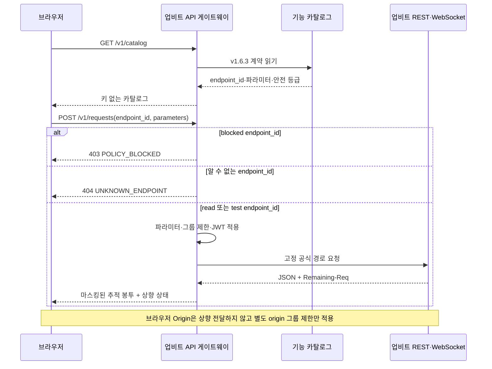

# 업비트 API 게이트웨이 설계

## 책임

`apps/upbit_gateway/`는 브라우저와 업비트 Open API 사이의 독립 보안·운영 경계다. 카탈로그의 `endpoint_id`만 받아 공식 경로를 선택하고, 키·JWT·Authorization 헤더·쿼리 해시(query hash)를 브라우저·응답·로그에 노출하지 않는다. 이 모듈은 JWT 인증(authentication), 그룹별 요청 제한(rate limit), `Remaining-Req`, 429·418 냉각(cooldown), 마스킹된 추적 봉투(Trace Envelope)를 소유한다. WebSocket 연결은 후속 범위다.

Issue #20의 REST 실행기는 `read`와 공식 `POST /v1/orders/test`인 `test`만 상향 호출한다. `blocked`는 자격 증명 로드, 요청 제한기, HTTP 클라이언트보다 먼저 403으로 종료한다. 알 수 없는 기능은 404, 계약 위반은 422, 상향 시간 초과는 504, 비 JSON 응답은 502로 구분하며 상향 JSON의 200·201·400·401·418·429 상태는 그대로 보존한다.

## 책임이 아닌 것

- 운영 서버의 수집·저장·분석 API와 PostgreSQL 접근
- 브라우저 화면, 동적 입력 폼, 결과 시각화
- 임의 호스트·경로 프록시
- 실제 주문, 모든 취소, 자산 이전, 입출금 생성·취소, 트래블룰 검증 실행

## 입력과 출력

- HTTP 계약은 [`upbit-gateway.openapi.yaml`](../contracts/api/upbit-gateway.openapi.yaml)을 따른다.
- 기능 선택은 URL이 아니라 [`upbit-api-catalog.yaml`](../contracts/upbit/upbit-api-catalog.yaml)의 `endpoint_id`로 제한한다.
- WebSocket 추적 이벤트는 [`upbit-gateway-websocket.schema.json`](../contracts/api/upbit-gateway-websocket.schema.json)을 따른다.
- REST 실행 결과는 `trace_id`, `endpoint_id`, 마스킹된 `request`, `response`, `rate_limit`, `duration_ms`, `received_at`을 가진 추적 봉투로 제공한다.

## 주요 흐름

실행 엔진은 `endpoint_id` 조회 → 안전 등급 검사 → 파라미터 검증 → 요청 제한 적용 → 필요한 경우에만 자격 증명 로드와 JWT 생성 → 고정 경로 전송 → 민감 정보 제거 → 추적 봉투 반환 순서를 지킨다. `blocked`는 자격 증명·제한·전송 단계에 도달할 수 없다. 브라우저의 `Origin`은 상향으로 전달하지 않지만 공식 시세 `origin` 그룹 1회/10초 제한에는 반영한다.

프로덕션 상향 기본 URL은 `https://api.upbit.com`으로 고정한다. 가짜 상류 서버는 명시적 테스트 플래그와 루프백(loopback) 호스트가 함께 있을 때만 허용한다. 429·418은 자동 재시도하지 않고 상태를 호출자에게 전달하면서 각각 다음 초 또는 `Retry-After` 기간 동안 해당 그룹을 냉각한다.

## 의존성

- FastAPI와 Pydantic은 게이트웨이 HTTP 경계를 제공한다.
- HTTPX는 고정 허용 목록 상향 전송과 시간 초과를, PyJWT는 HS512 서명을 제공한다.
- JWT는 매 요청 새 UUID nonce를 사용하며, 쿼리와 JSON 본문의 입력 순서를 보존한 비 URL 인코딩 문자열의 SHA512 해시를 사용한다.
- 자격 증명은 저장소 밖 환경 변수 한 쌍 또는 절대 경로의 읽기 전용 일반 파일 한 쌍에서 지연 로드한다. 두 방식을 섞거나 일부만 설정하면 상향 호출 전에 실패한다.
- PyYAML은 저장소의 기계 검증 카탈로그를 읽는다.
- 프로젝트는 `uv run python`과 wheel의 설치 가능 패키지로 게이트웨이를 노출한다. 런타임은 `importlib.resources`로 패키지 데이터(package data)를 읽으므로 저장소나 현재 작업 디렉터리(CWD)에 의존하지 않으며, 계약 테스트가 패키지 복사본과 `docs/contracts/` 단일 기준(source of truth)의 바이트 동등성을 보장한다.
- 게이트웨이는 운영 서버나 DB에 의존하지 않는다.
- 공식 기능·파라미터·제한의 외부 기준은 업비트 개발자 센터 v1.6.3의 `llms.txt`와 개별 공식 마크다운(markdown)이다.

## 관련 계약과 결정

- [업비트 기능 카탈로그](../contracts/upbit/upbit-api-catalog.yaml)
- [게이트웨이 OpenAPI](../contracts/api/upbit-gateway.openapi.yaml)
- [게이트웨이 WebSocket 스키마](../contracts/api/upbit-gateway-websocket.schema.json)
- [ADR-0011](../ADR/ADR-0011-업비트-API-게이트웨이와-비파괴-테스트-경계.md)
- [GitHub Issue #19](https://github.com/goodjoon-company/goodmoneying/issues/19)
- [GitHub Issue #20](https://github.com/goodjoon-company/goodmoneying/issues/20)

## 리스크와 후속 작업

- 공식 문서는 정책 변경이 가능하므로 실행 기능을 추가할 때마다 현재 문서를 다시 확인한다.
- WebSocket 연결 운용과 프론트엔드 기능별 시각화는 후속 Issue에서 구현한다.
- 실제 주문·취소·자산 이전·입출금·트래블룰 검증은 계속 `blocked`이며 실행 범위로 확장하지 않는다.
