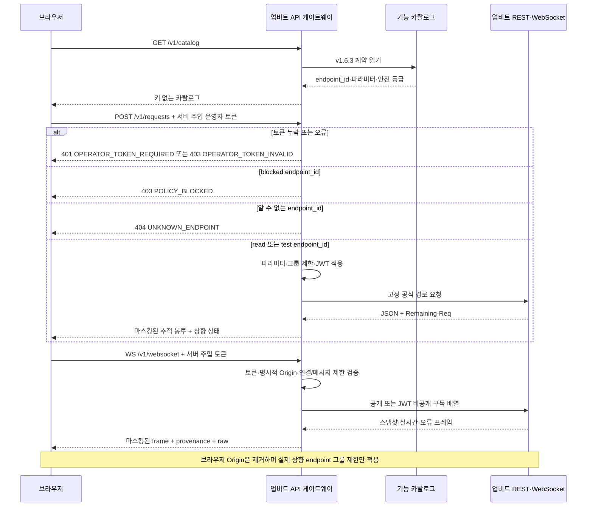

# 업비트 API 게이트웨이 설계

## 책임

`apps/upbit_gateway/`는 브라우저와 업비트 Open API 사이의 독립 보안·운영 경계다. 카탈로그의 `endpoint_id`만 받아 공식 경로를 선택하고, 키·JWT·Authorization 헤더·쿼리 해시(query hash)를 브라우저·응답·로그에 노출하지 않는다. 이 모듈은 REST·공개/비공개 WebSocket, JWT 인증(authentication), 그룹별 요청 제한(rate limit), `Remaining-Req`, 429·418 냉각(cooldown), 재연결과 마스킹된 추적 봉투(Trace Envelope)를 소유한다.

Issue #20의 REST 실행기는 `read`와 공식 `POST /v1/orders/test`인 `test`만 상향 호출한다. `POST /v1/requests`는 카탈로그 조회와 실행 전에 운영자 토큰을 검증해 누락은 401, 오류는 403으로 종료한다. `blocked`는 자격 증명 로드, 요청 제한기, HTTP 클라이언트보다 먼저 로컬 403으로 종료한다. 알 수 없는 REST 기능은 로컬 404, 계약 위반은 로컬 422, 상향 시간 초과는 로컬 504, 비 JSON 응답은 로컬 502로 구분한다. 명시한 상향 JSON 상태뿐 아니라 501·505 같은 임의 상태도 원래 상태의 추적 봉투(Trace Envelope)로 보존한다. 401·403·404·422·502·503·504는 로컬 오류와 상향 상태가 겹치므로 응답 본문 스키마(schema)로 구분한다.

웹 정적 서버의 같은 출처 역방향 프록시(reverse proxy)는 운영자 토큰을 서버에서 주입한다. REST 실행은 `UPBIT_GATEWAY_OPERATOR_TOKEN`과 `X-Operator-Token`을 상수 시간 비교(constant-time comparison)하며, health와 카탈로그는 토큰 없이 조회할 수 있다. 하향 WebSocket은 운영자 토큰과 `UPBIT_GATEWAY_ALLOWED_ORIGINS`의 명시적 출처 허용 목록을 모두 만족해야 한다. 전달 `Host`·`X-Forwarded-Host`는 DNS 재바인딩(DNS rebinding)에 악용될 수 있으므로 인증 근거로 사용하지 않는다.

## 책임이 아닌 것

- 운영 서버의 수집·저장·분석 API와 PostgreSQL 접근
- 브라우저 화면, 동적 입력 폼, 결과 시각화
- 임의 호스트·경로 프록시
- 실제 주문, 모든 취소, 자산 이전, 입출금 생성·취소, 트래블룰 검증 실행

## 입력과 출력

- HTTP 계약은 [`upbit-gateway.openapi.yaml`](../contracts/api/upbit-gateway.openapi.yaml)을 따른다.
- 기능 선택은 URL이 아니라 [`upbit-api-catalog.yaml`](../contracts/upbit/upbit-api-catalog.yaml)의 `endpoint_id`로 제한한다.
- WebSocket 추적 이벤트는 [`upbit-gateway-websocket.schema.json`](../contracts/api/upbit-gateway-websocket.schema.json)을 따른다.
- REST 실행 결과는 `trace_id`, `endpoint_id`, 마스킹된 `request`, `response`, `rate_limit`, `duration_ms`, `received_at`을 가진 추적 봉투로 제공한다.

## 주요 흐름

실행 엔진은 REST 전용 `endpoint_id` 조회 → 안전 등급 검사 → 파라미터 검증 → 요청 제한 적용 → 필요한 경우에만 자격 증명 로드와 JWT 생성 → 고정 경로 전송 → 민감 정보 제거 → 추적 봉투 반환 순서를 지킨다. 파라미터 검증은 스칼라 타입·열거형(enum)·범위뿐 아니라 배열(array)의 `items` 스키마를 재귀 적용하고 숫자의 유한성까지 확인한다. 따라서 잘못된 배열 요소는 요청 제한·자격 증명·네트워크보다 먼저 로컬 422로 종료된다. WebSocket 식별자는 REST 계약 경계에서 422로 거부하고, `blocked`는 자격 증명·제한·전송 단계에 도달할 수 없다. 브라우저의 `Origin`은 상향 요청에서 제거한다. 업비트가 실제로 `Origin`을 수신한 요청에만 적용하는 `origin` 그룹 1회/10초를 게이트웨이가 임의 적용하지 않으며, 시세 조회는 실제 상향 `market`·`candle`·`trade`·`ticker`·`orderbook` 그룹의 공식 10회/초를 따른다.

WebSocket은 하향 연결마다 공개·비공개 상향 세션을 독립 관리한다. 연결 초당 5회와 연결별 메시지 초당 5회·분당 100회를 카탈로그에서 적용하고, 전체 희망 구독 스냅샷(snapshot)을 다시 보내 Upbit의 구독 교체 의미론을 보존한다. 이진 JSON 프레임을 해독하고 연결 ID·순서·수신 시각·가시성·포맷·`endpoint_id`를 출처(provenance)에 기록한다. 일시 오류는 지수형 재시도 지연(backoff)으로 재연결·재구독하고, 재시도 소진 뒤 같은 하향 세션의 제어는 `SESSION_CLOSED`로 거부한다. 최근 raw 프레임은 200개로 제한하고 민감 필드를 제거한다.

프로덕션 상향 기본 URL은 `https://api.upbit.com`으로 고정한다. 가짜 상류 서버는 명시적 테스트 플래그와 루프백(loopback) 호스트가 함께 있을 때만 허용한다. 429·418은 자동 재시도하지 않고 상태를 호출자에게 전달한다. 429는 해당 그룹을 다음 초까지 냉각하고, 418은 `Retry-After` 헤더와 공식 오류 JSON 본문의 기간·차단 종료 시각·메시지에서 읽은 값 중 가장 긴 기간을 적용한다. `Remaining-Req`의 `sec=0`, 뒤따르는 더 짧은 418, 잘못된 값은 기존 냉각을 줄이지 않는다. `nan`·`inf`처럼 유한하지 않은 값은 거부하고 유효한 기간이 하나도 없으면 보수적으로 60초를 적용한다.

## 의존성

- FastAPI와 Pydantic은 게이트웨이 HTTP 경계를 제공한다.
- HTTPX는 고정 허용 목록 상향 전송과 시간 초과를, PyJWT는 HS512 서명을 제공한다.
- JWT는 매 요청 새 UUID nonce를 사용한다. 배열 키 반복과 입력 순서, 불리언(boolean) 소문자 표현을 가진 하나의 정규 토큰 열(token sequence)을 만든다. 이 토큰에서 업비트 인증 규칙에 맞춘 비인코딩 해시 쿼리와 안전한 전송 쿼리를 각각 파생한다. 전송 쿼리는 배열 키의 `[]`만 보존하고 값의 `+`·`&`·`#`·`:` 같은 예약 문자를 백분율 인코딩(percent-encoding)해 파라미터 주입·프래그먼트(fragment) 절단을 막는다.
- 자격 증명은 저장소 밖 환경 변수 한 쌍 또는 절대 경로의 읽기 전용 일반 파일 한 쌍에서 지연 로드한다. 두 방식을 섞거나 일부만 설정하면 상향 호출 전에 실패한다.
- Compose에서 파일 자격 증명을 쓸 때는 저장소 밖 파일을 `chmod 400`으로 읽기 전용 설정하고 그 절대 경로를 `UPBIT_ACCESS_KEY_FILE`·`UPBIT_SECRET_KEY_FILE`로 지정한 뒤 `docker-compose.upbit-secrets.yml`을 추가 병합한다. 추가 병합 파일은 호스트의 직접 키 환경 변수를 명시적 빈 문자열로 덮어쓰고 Compose 비밀정보(Secret)를 컨테이너의 `/run/secrets/`에 연결하므로, 값은 저장소나 이미지에 들어가지 않고 파일 소스와 혼용되지 않는다.
- PyYAML은 저장소의 기계 검증 카탈로그를 읽는다. 실행 제한기는 별도 상수를 복제하지 않고 카탈로그의 REST endpoint가 참조하는 `rate_limits`에서 그룹별 횟수·구간을 구성한다.
- 프로젝트는 `uv run python`과 wheel의 설치 가능 패키지로 게이트웨이를 노출한다. 런타임은 `importlib.resources`로 패키지 데이터(package data)를 읽으므로 저장소나 현재 작업 디렉터리(CWD)에 의존하지 않으며, 계약 테스트가 패키지 복사본과 `docs/contracts/` 단일 기준(source of truth)의 바이트 동등성을 보장한다.
- 게이트웨이는 운영 서버나 DB에 의존하지 않는다.
- 공식 기능·파라미터·제한의 외부 기준은 업비트 개발자 센터 v1.6.3의 `llms.txt`와 개별 공식 마크다운(markdown)이다.

## 관련 계약과 결정

- [업비트 기능 카탈로그](../contracts/upbit/upbit-api-catalog.yaml)
- [게이트웨이 OpenAPI](../contracts/api/upbit-gateway.openapi.yaml)
- [게이트웨이 WebSocket 스키마](../contracts/api/upbit-gateway-websocket.schema.json)
- [ADR-0011](../ADR/ADR-0011-업비트-API-게이트웨이와-비파괴-테스트-경계.md)
- [GitHub Issue #19](https://github.com/goodjoon-company/goodmoneying/issues/19)
- [GitHub Issue #20](https://github.com/goodjoon-company/goodmoneying/issues/20)
- [GitHub Issue #21](https://github.com/goodjoon-company/goodmoneying/issues/21)
- [GitHub Issue #22](https://github.com/goodjoon-company/goodmoneying/issues/22)
- [GitHub Issue #23](https://github.com/goodjoon-company/goodmoneying/issues/23)
- [GitHub Issue #24](https://github.com/goodjoon-company/goodmoneying/issues/24)

## 리스크와 후속 작업

- 공식 문서는 정책 변경이 가능하므로 실행 기능을 추가할 때마다 현재 문서를 다시 확인한다.
- 프로세스 메모리 요청 제한기는 단일 게이트웨이 인스턴스 경계다. 다중 복제 운영은 공유 제한 저장소와 포켓 단위 조정이 필요하다.
- 실제 주문·취소·자산 이전·입출금·트래블룰 검증은 계속 `blocked`이며 실행 범위로 확장하지 않는다.
