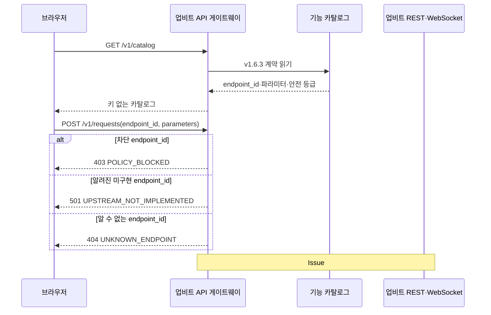

# 업비트 API 게이트웨이 설계

## 책임

`apps/upbit_gateway/`는 브라우저와 업비트 Open API 사이의 독립 보안·운영 경계다. 카탈로그의 `endpoint_id`만 받아 공식 경로를 선택하고, 키·JWT·Authorization 헤더를 브라우저·응답·로그에 노출하지 않는다. 이후 이 모듈이 그룹별 요청 제한, `Remaining-Req`, 429·418 처리, 마스킹된 추적 봉투(Trace Envelope), 공개·비공개 WebSocket 연결을 소유한다.

Issue #19의 실행 골격은 `/health`, `/v1/catalog`, `/v1/requests`의 로컬 판정까지만 제공한다. 차단 기능은 403, 알려진 미구현 기능은 501, 알 수 없는 기능은 404, 요청 형식 오류는 422로 구분한다. 업비트 상향 호출 코드는 의도적으로 없다.

## 책임이 아닌 것

- 운영 서버의 수집·저장·분석 API와 PostgreSQL 접근
- 브라우저 화면, 동적 입력 폼, 결과 시각화
- 임의 호스트·경로 프록시
- 실제 주문, 모든 취소, 자산 이전, 입출금 생성·취소, 트래블룰 검증 실행

## 입력과 출력

- HTTP 계약은 [`upbit-gateway.openapi.yaml`](../contracts/api/upbit-gateway.openapi.yaml)을 따른다.
- 기능 선택은 URL이 아니라 [`upbit-api-catalog.yaml`](../contracts/upbit/upbit-api-catalog.yaml)의 `endpoint_id`로 제한한다.
- WebSocket 추적 이벤트는 [`upbit-gateway-websocket.schema.json`](../contracts/api/upbit-gateway-websocket.schema.json)을 따른다.
- REST 실행 결과는 후속 Issue에서 `trace_id`, `endpoint_id`, 마스킹된 `request`, `response`, `rate_limit`, `duration_ms`, `received_at`을 가진 추적 봉투로 제공한다.

## 주요 흐름

후속 실행 엔진은 `endpoint_id` 조회 → 파라미터 검증 → 안전 등급 검사 → 인증·요청 제한 적용 → 업비트 전송 → 민감 정보 제거 → 추적 봉투 반환 순서를 지킨다. `blocked`는 전송 단계에 도달할 수 없다.

## 의존성

- FastAPI와 Pydantic은 게이트웨이 HTTP 경계를 제공한다.
- PyYAML은 저장소의 기계 검증 카탈로그를 읽는다.
- 프로젝트는 `uv run python`과 wheel의 설치 가능 패키지로 게이트웨이를 노출한다. 런타임은 `importlib.resources`로 패키지 데이터(package data)를 읽으므로 저장소나 현재 작업 디렉터리(CWD)에 의존하지 않으며, 계약 테스트가 패키지 복사본과 `docs/contracts/` 단일 기준(source of truth)의 바이트 동등성을 보장한다.
- 게이트웨이는 운영 서버나 DB에 의존하지 않는다.
- 공식 기능·파라미터·제한의 외부 기준은 업비트 개발자 센터 v1.6.3의 `llms.txt`와 개별 공식 마크다운(markdown)이다.

## 관련 계약과 결정

- [업비트 기능 카탈로그](../contracts/upbit/upbit-api-catalog.yaml)
- [게이트웨이 OpenAPI](../contracts/api/upbit-gateway.openapi.yaml)
- [게이트웨이 WebSocket 스키마](../contracts/api/upbit-gateway-websocket.schema.json)
- [ADR-0011](../ADR/ADR-0011-업비트-API-게이트웨이와-비파괴-테스트-경계.md)
- [GitHub Issue #19](https://github.com/goodjoon-company/goodmoneying/issues/19)

## 리스크와 후속 작업

- 공식 문서는 정책 변경이 가능하므로 실행 기능을 추가할 때마다 현재 문서를 다시 확인한다.
- 후속 Issue #20에서 인증, 허용 목록 실행 엔진, 그룹별 제한, 마스킹, 가짜 업비트 서버 통합 테스트를 구현한다.
- WebSocket 연결 운용과 프론트엔드 E2E는 해당 후속 Issue에서 구현한다.
