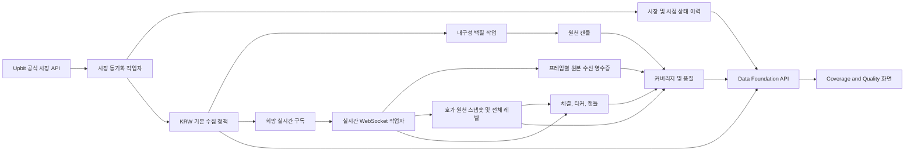

# 업비트 데이터 기반 모듈 설계(Module Design)

상태: 구현됨(Implemented)
버전: 2.0.0
최종 갱신: 2026-07-17
관련 제품: [`docs/01_Product.md`](../01_Product.md)
관련 계약: [`docs/contracts/README.md`](../contracts/README.md)
관련 이슈: [#28](https://github.com/goodjoon-company/goodmoneying/issues/28)

## 1. 목적과 경계

이 모듈은 업비트(Upbit) 공식 시장 카탈로그를 시점 이력으로 보존하고, 모든 원화(KRW) 시장에 2024-01-01 UTC 기본 수집 정책을 적용한다. 정책 대상은 별도 시작 명령 없이 과거 캔들 백필(Backfill)과 실시간 체결·호가·티커 구독으로 이어진다.

주식, 타 거래소 실제 연동, 지표·전략·백테스트, 개인 주문과 체결은 이 모듈의 범위가 아니다. 기존 `instruments`, `collection_targets`, `collection_plans`와 운영 화면은 무손실 전환 기간의 호환 소비자이며 새 정책의 권위 모델은 아니다.

## 2. 권위 경계

- DB 단일 기준(source of truth): `docs/contracts/db/migrations/` 아래 [`20260717000100_system_trading_data_foundation.sql`](../contracts/db/migrations/20260717000100_system_trading_data_foundation.sql)
- 생성 스냅숏(snapshot): [`schema.sql`](../contracts/db/schema.sql)
- HTTP 계약: [`openapi.yaml`](../contracts/api/openapi.yaml)의 `/v1/data-foundation`
- 공식 외부 제약: [`upbit-api-catalog.yaml`](../contracts/upbit/upbit-api-catalog.yaml)과 작업 시점의 Upbit 개발자센터 최신 문서
- 상태·재현성 결정: [`ADR-0013`](../ADR/ADR-0013-UTC-원천-결측-재현성.md)

아키텍처 문서는 필드와 제약을 복제하지 않고 흐름과 책임만 설명한다.
런타임 API와 worker는 DDL(Data Definition Language)을 실행하지 않으며 dbmate migration만 스키마를 변경한다.

## 3. 런타임 흐름

1. `market-sync-worker`가 상세 시장 목록을 5분마다 한 번 요청한다.
2. 정규화 전에 endpoint·query·요청/응답 시각·HTTP 상태·원문 JSON·checksum·수집기/스키마 버전을 fetch manifest로 저장한다. 성공 상태 이력은 해당 manifest를 참조하며, 실패 또는 빈 2xx 응답은 기존 상태를 바꾸지 않고 실패 manifest만 남긴다.
3. `(exchange, market_code)`로 시장을 멱등 업서트하고 상태 지문이 바뀐 때만 이전 유효 구간을 닫고 새 이력을 연다.
4. KRW 시장은 캔들·체결·호가·티커 네 데이터 유형의 자동 관리 대상으로 편입한다. 신규 상장도 같은 규칙을 적용하며 운영자가 일시정지·제외할 수 있다.
5. 캔들 대상은 안정된 멱등 키를 가진 PostgreSQL 백필 작업을 만든다. 작업자는 `FOR UPDATE SKIP LOCKED`와 만료 임대로 하나의 작업만 소유하고 재시작 뒤 만료 작업을 회수한다.
6. 체결·호가·티커 대상은 희망 구독(desired subscription)과 세대를 저장한다. 실시간 작업자는 300초마다 연결을 정상 회전해 최신 정책을 다시 읽고, 실제 연결 뒤 정확히 읽었던 `(target_spec_id, generation)`만 적용 완료로 표시한다.
7. 사용자가 정책을 바꾸면 희망 구독 세대가 증가한다. 프로세스 메모리가 아니라 DB 상태가 복구 기준이다.

## 4. 수집 정책

기본 정책은 모든 공식 KRW 시장, 시작 `2024-01-01T00:00:00Z`, 1분 원천 캔들, 실시간 체결·호가·티커, 연속 수집, 우선순위 100, 보존 기한 없음이다. BTC·USDT 시장은 카탈로그와 상태 이력에는 보존하지만 운영자가 명시적으로 확장하기 전 자동 대상이 아니다.

정책 활성화는 다음 효과를 하나의 트랜잭션 경계 안에서 만든다.

- 필요한 캔들 범위의 자동 백필 작업 생성
- 실시간 데이터 유형의 희망 구독 활성화
- 기존 제외 상태의 카탈로그 재동기화 보호
- 기존 `collection_targets`·`collection_plans` 호환 쓰기

요청 수 제한 응답은 숨겨 재시도하지 않는다. 429는 다음 초 경계 이후, 418은 응답의 `Retry-After` 또는 본문 차단 시간 이후에만 새 멱등 GET을 후속 스케줄링한다. 418 응답에 기간이 없으면 보수적으로 5분을 사용한다. 작업별 기본 지수 백오프는 5초에서 시작해 5분으로 제한하되 거래소가 준 냉각 시간이 더 길면 그 값을 우선한다. 주문·취소 재시도 규칙은 이 읽기 전용 파이프라인에 적용하지 않는다.

## 5. 시간과 원천 의미

- PostgreSQL 기본·세션 시간대, 컨테이너와 내부 계산은 UTC다.
- API wire 시각은 RFC 3339이며 UI에서만 KST를 명시해 표시한다.
- 원천 사건 시각, 수신 시각, 저장 시각, 지식 가능 시각을 분리한다.
- 가격·수량·금액은 PostgreSQL `numeric`과 Python `Decimal`을 사용한다.
- 자연키 업서트로 같은 시장·주기·시각의 중복 저장을 막는다.
- 웹소켓 연결마다 UUID를 만들고 모든 프레임에 1부터 증가하는 sequence를 부여한다. `(connection_id, frame_sequence)` receipt는 같은 전달의 재처리만 억제하고, 다른 연결에서 다시 받은 동일 payload는 별도 전달 사실로 남긴다.
- 호가 payload는 정규화 전 전체 JSON과 checksum을 receipt에 저장한 뒤, 동일 경제 상태 snapshot과 전체 호가 레벨, 기존 10레벨 summary를 같은 PostgreSQL 트랜잭션으로 저장한다.
- `retention_days`가 설정된 원본 orderbook receipt와 snapshot은 사건 시각 기준 경계보다 오래된 행만 정리하며 level은 cascade로 정리한다. 이것이 P1의 전체 실행 범위다. 정규화 캔들·체결·티커 정리는 P7 용량 정책 전에는 실행하지 않으며 summary와 fetch manifest도 삭제하지 않는다.
- Coverage & Quality는 P1에서 KRW 화면 필터를 제공한다. BTC·USDT 카탈로그는 저장하되 화면 일반화와 자동 편입은 후속 범위다.

과거 호가·티커·실시간 체결은 수집 전 구간을 합성하지 않고 `unavailable`로 초기화한다. 과거 캔들은 백필 증거가 확정되기 전 `unverified`다. 상태는 `available`, `no_trade`, `missing`, `unavailable`, `unverified` 다섯 가지뿐이다. 업비트 공식 분 캔들 계약에 따라 성공 응답의 양쪽 캔들로 완전히 경계된 내부 분 공백만 `no_trade`로 확정하며 빈 응답과 페이지 선두·후미 공백은 확정하지 않는다. 상세 판정 순서는 도메인 설계와 DB 계약을 따른다.

시장 거래 중단·카탈로그 누락은 관측 시각부터 `unavailable` 열린 구간을 만들며 DB에서는 열린 끝을 `9999-01-01T00:00:00Z` sentinel로 표현한다. 시장 재등장 시 기존 시장 사유 구간을 재등장 관측 시각에서 닫고 이후를 `unverified`로 분류해 새 수집 증거를 기다린다. sentinel은 실제 미래 시각이 아니라 상한 없는 도메인 구간의 저장 표현이다. 이 전이를 포함한 모든 커버리지 변경은 공통 PostgreSQL 구간 전이 구현이 잠금, 분할, 품질 이벤트와 fingerprint를 일관되게 처리한다.

## 6. 무손실 전환

P1 마이그레이션은 확장 전용이다. 기존 행을 삭제하거나 이름을 바꾸지 않고 새 시장·정책·품질 테이블을 추가한 뒤 기존 식별자를 연결한다. 원천 테이블에는 nullable 시장·사건·수신·저장·지식·manifest 참조를 추가한다. 롤백은 새 데이터를 파괴하지 않도록 안내만 제공하고 테이블 삭제를 수행하지 않는다.

구 전용 경로는 최소 한 릴리스의 dual-write와 백업·복구 리허설 뒤 별도 승인으로만 수축한다. 현재 운영 UI의 수동 Backfill은 호환 진단 도구이며 자동 정책의 시작 조건이 아니다.

## 7. API와 운영 화면

`GET /v1/data-foundation`은 UTC 정책 시작, 시장·활성 대상·대기 백필·희망 구독 수, 5단계 품질 구간, 시장별 공식 상태와 정책 스냅숏을 반환한다. 화면은 이를 KST로 변환한다. `PATCH /v1/data-foundation/markets/{marketCode}`는 운영자 토큰, 사유와 `requestId·idempotencyKey·actorId·requestedAt` 명령 envelope를 요구한다. 같은 키·같은 payload는 저장 결과를 재사용하고 다른 payload는 409로 거부한다. 현재 백필 워커가 1분 원천 캔들만 실행하므로 API는 `1m`만 허용한다.

Coverage & Quality 화면은 색상과 함께 아이콘·문자 상태를 사용한다. 1440px과 390px에서 본문 가로 넘침 없이 동작하고 키보드로 정책을 변경할 수 있다. 표 자체가 넓으면 내부 스크롤 컨테이너만 사용한다.

## 8. 장애와 복구

- 시장 동기화 실패는 기존 정책을 삭제하지 않고 다음 주기에 다시 시도한다.
- 백필은 임대 만료 전 같은 instance를 포함한 다른 실행이 가져갈 수 없고, 진행·결과 쓰기도 현재 임대 소유자만 수행한다. 만료 뒤 시도 횟수를 올려 회수하고, 부분 저장·진행 시각은 보존한다. 실패 시 다음 재시도 시각까지 대기하며 예산을 소진하면 작업·미완료 target·미확인 coverage를 실패 격리(dead letter)하고 품질 전이 이벤트를 남긴다.
- prod-home 장기 백필 claim은 기본 폐쇄다. 영속 gate의 운영 승인, 24시간 이내 백업 검증, `free_capacity_bytes >= required_capacity_bytes`, 실행 릴리스 SHA와 승인 SHA 일치가 모두 확인될 때만 claim한다. P7/P8 전에는 실운영 gate를 열지 않는다.
- 실시간 연결은 버퍼를 저장한 뒤 주기적으로 회전한다. 연결 성공 전에는 적용 완료 세대를 기록하지 않는다.
- 카탈로그에서 사라진 활성 시장은 시점 이력에 거래 중단으로 추가하고 자동 대상은 일시정지한다.
- 명시적 제외는 카탈로그 재동기화로 되돌리지 않는다.

## 9. 검증 게이트

- 단위: UTC, 기본 대상, 5단계 판정, 임대 가능 조건, 429·418 무은닉 재시도
- 계약: 확장 전용 마이그레이션, 중복·중첩 방지, OpenAPI 경로·스키마
- 통합: 빈 PostgreSQL 두 번 적용, 기존 행 보존, 스냅숏 동일, API 200, 정확 세대 구독 적용
- 브라우저 E2E: 정책 시작·다섯 상태·정책 변경·키보드·1440/390 반응형·런타임 오류 0건
- 전체 게이트: Ruff, Mypy, Pytest, Vitest, production build, `git diff --check`

실제 명령과 결과는 P1 검증 증적에 기록한다.

운영 내구성 계약은 PostgreSQL만 권위가 있다. SQLite repository는 과거 단위·API 테스트용 호환 어댑터이며 lease·retry·dead-letter 동등성을 제공하지 않는다. 운영·E2E·배포 프로필은 SQLite를 사용하지 않는다.
