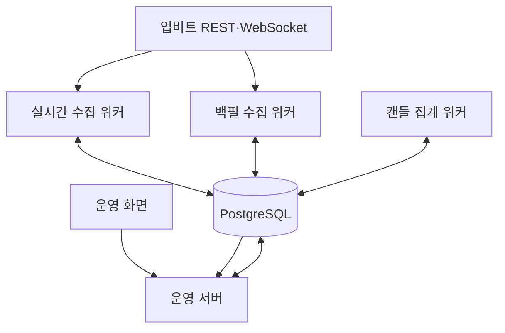

# 업비트 수집 파이프라인 개발 사양

Status: Accepted
Last Updated: 2026-07-15
Related Product: `docs/01_Product.md`
Related Task: `docs/Task/M1.md`
Related DB Contract: `docs/contracts/db/migrations/`, `docs/contracts/db/schema.sql`
Related API Contract: `docs/contracts/api/openapi.yaml`, `docs/contracts/api/realtime-analysis-websocket.schema.json`, `docs/contracts/api/realtime-system-management-websocket.md`

## 문서 역할

이 문서는 업비트 수집 파이프라인의 **모듈 경계, 책임, 입력·출력, 실행·복구 규칙**을 정의한다. 전체 시스템의 구성과 코드 레이어는 [아키텍처 개발 사양](../02_Architecture.md), 제품 결과와 요구사항 ID는 [제품 개발 사양](../01_Product.md), 테이블·API·실시간 메시지의 정확한 형식은 `docs/contracts/`를 따른다.

## 모듈 한눈에 보기

원천 수집·집계·조회는 모두 PostgreSQL을 통해 느슨하게 결합한다. 워커가 브라우저에 직접 데이터를 보내거나, 운영 서버가 외부 업비트 API를 대신 수집하는 구조는 현재 범위가 아니다.

## 책임

업비트 수집 파이프라인(Upbit Collection Pipeline)은 완료된 M1~M3 데이터 기반의 핵심 경계다. 업비트(Upbit) KRW 마켓 데이터를 수집·저장하고 품질과 내부 운영 상태를 제공한다. 현재 Post-MVP 제품화에서는 관심종목과 코인 상세의 투자 후보 탐색을 지지하되, 운영 화면 자체를 최종 제품 가치로 확장하지 않는다.

- 수집 후보군(Collection Candidate Pool) 갱신
- 활성 수집 대상(Active Collection Target) 최대 50개 유지
- 코인별 수집 계획(Collection Plan)과 저장된 화면용 수집 상태 View Model 유지
- 원천 캔들(Source Candle), 현재가 스냅샷(Ticker Snapshot), 체결 이벤트(Trade Event), 호가 요약(Orderbook Summary) 수집
- 백필(Backfill), 증분 수집(Incremental Collection), 데이터 완전성 검사(Data Completeness Check)
- 수집 실행(Collection Run), 대상별 수집 결과(Target Collection Result), 결측 구간(Missing Range), 수집 진행률(Collection Coverage) 기록
- 수집 워커 heartbeat와 worker 현황판용 상태 View Model 제공
- 분석용 캔들 집계 테이블(Candle Rollup)과 자동 집계 작업(Candle Aggregation Job) 유지
- 운영 서버(Operations Server)를 통한 화면 API와 원천 리소스 API 제공
- 감사 로그(Audit Log), 알림 이벤트(Notification Event) 저장

## 책임이 아닌 것

- 국내 주식과 미국 주식 수집
- 뉴스, 공시, 증권사 리포트 수집
- 대규모 언어 모델(LLM, Large Language Model) 요약과 구조화 신호(Signal)
- 전략, 백테스트(Backtest), 봇(Bot), 시뮬레이션(Simulation), 모의매매(Paper Trading), 실거래(Live Trading)
- 메시지 큐(Message Queue) 기반 다중 워커 작업 분배
- 삭제 후 재수집(Destructive Rebuild)
- 외부 알림 발송

## 구성요소

| 구성요소 | 책임 | 구현 기준 |
|---|---|---|
| 실시간 수집 워커(Realtime Collection Worker) | 업비트 웹소켓(WebSocket) 시세 스트림 수신, 수집 후보군과 증분 수집 저장. 런타임은 `GOODMONEYING_LIVE_UPBIT=1` live 프로필만 허용 | Python 단일 프로세스 |
| 백필 수집 워커(Backfill Collection Worker) | DB 상태 폴링으로 pending 백필 작업 확인, 원천 캔들 결측 구간 백필 실행, fetch 성공 heartbeat와 DB batch upsert 완료 기준 진행 상태 기록 | Python 단일 프로세스, 기본 10초 폴링, 기본 최대 3000개 저장 배치(batch) |
| 캔들 집계 워커(Candle Aggregation Worker) | 원천봉보다 오래된 집계 단위를 감지하고 작업 대상별 OHLCV rollup을 upsert, 진행률과 처리량 독립 하트비트(heartbeat) 기록 | Python 단일 프로세스, 기본 5초 폴링·작업 중 5초 하트비트 실행기(ticker), 집계와 별도 DB 연결, I/O(Input/Output) 2초 제한·종료 3초 유예 |
| 운영 서버(Operations Server) | 화면 단위 View Model API, 원천 리소스 API, 쓰기 API, 저장된 worker 상태 조회 | FastAPI |
| 운영 화면 | 데이터 수집관리 내비게이션, worker 현황판, 대시보드, Backfill 관리, 백필 제어, 관심종목, 코인 상세 레이어, 코인 분석 | React, 기존 대시보드/관심종목은 SSE(Server-Sent Events), 코인 분석은 WebSocket 증분 메시지, React Query HTTP 폴링(Polling) 보조 |
| PostgreSQL | 원천 사실, 설정, 품질, 감사, 알림 이벤트 저장. API·워커 런타임은 DDL(Data Definition Language)을 실행하지 않는다. | 변경 이력 `docs/contracts/db/migrations/`, 생성 스냅샷 `docs/contracts/db/schema.sql` |

## 입력과 출력

### 입력

- 업비트 KRW 마켓 현재가 API 응답
- 업비트 1분 캔들 API 응답
- 업비트 일봉 API 응답
- 업비트 호가 API 응답
- 업비트 웹소켓(WebSocket) 체결(Trade) 이벤트
- 운영 화면의 활성 수집 대상 변경
- 운영 화면의 코인별 수집 계획 변경
- 운영 화면의 수집 범위 설정 변경
- 운영 화면의 백필 시작과 제어 명령

### 출력

- PostgreSQL 원천 사실 테이블
- PostgreSQL 코인별 수집 계획과 커버리지(Coverage) View Model 테이블
- 화면 단위 API 응답
- 내부 안정 계약(Internal Stable Contract)인 원천 리소스 API 응답
- 감사 로그(Audit Log)
- 알림 이벤트(Notification Event)

## 주요 흐름

### 흐름 선택표

| 사용자가 본 상태 | 시작 구성요소 | 저장 결과 | 복구 경로 |
|---|---|---|---|
| 현재 시장 데이터 갱신 | 실시간 수집 워커 | 현재가·호가·체결·1분 원천봉, heartbeat | 워커 재시작과 최신성·오류 확인 |
| 과거 캔들 부족 | 운영 서버 → 백필 수집 워커 | 원천 캔들, 백필 작업·대상 진행 상태 | 결측 구간만 재계산해 재개 |
| 분석 단위가 오래됨 | 캔들 집계 워커 | 집계 봉, 집계 작업·대상 진행 상태 | 멱등 upsert 재실행, 원천봉 보조 조회 |
| 품질 경고·결측 | 완전성 검사와 운영 서버 | 결측 구간·커버리지·화면용 상태 | Backfill 계획 생성과 실행 |

### 수집 후보군 갱신

1. 수집 워커가 업비트 KRW 마켓 전체 현재가 스냅샷을 조회한다.
2. 24시간 누적 거래대금 기준으로 내림차순 정렬한다.
3. 상위 100개를 후보군 스냅샷(Candidate Pool Snapshot)으로 저장한다.
4. 최초 실행 시 상위 50개를 활성 수집 대상으로 자동 체크할 수 있다.
5. 기존 활성 수집 대상이 상위 100 밖으로 이탈해도 자동 제거하지 않고 후보군 이탈 대상(Out-of-Pool Target)으로 표시한다.

### 증분 수집

1. 실시간 수집 워커가 활성 수집 대상을 읽는다.
2. live 프로필에서는 현재가 스냅샷, 체결 이벤트, 호가 요약을 업비트 웹소켓(WebSocket) `ticker`/`trade`/`orderbook` 스트림으로 수신한다.
3. live 프로필에서는 1분 원천 캔들을 업비트 웹소켓(WebSocket) `candle.1m` 스트림으로 수신한다. 캔들 스트림은 체결이 발생해 캔들 값이 바뀔 때 전송되므로, 1분마다 모든 코인의 이벤트가 반드시 발생한다고 가정하지 않는다.
4. 체결 이벤트는 `trade_events`에 저장하고, 운영 대시보드의 실시간 히트맵은 시간당 체결 수를 분당 평균으로 환산해 빨강/주황/노랑/파랑/초록 단계로 표시한다.
5. 일봉은 10~30분 주기 또는 하루 마감 후 보정한다.
6. 모든 API 호출은 워커 내부 rate limiter를 통과한다. 현재 두 수집 워커 프로세스가 업비트 API 한도를 공유하므로 백필 수집 워커 동시성은 1로 제한한다.
7. 각 수집은 수집 실행과 대상별 수집 결과를 남긴다.
8. 실시간 수집 워커는 실행 시작과 성공/오류 상태를 `collection_worker_heartbeats`에 남긴다.
9. 수집 또는 배치 시점에 코인별 수집 계획의 기간, 데이터별 최신성, 결측 구간, 구간형 진행 상태를 계산해 저장된 View Model을 갱신한다.

### 백필

1. 사용자는 Backfill 관리 화면에서 백필 후보 코인을 체크한다.
2. 사용자가 백필 계획 생성 버튼을 누르면 운영 화면은 수집 범위와 백필 옵션을 설정하는 레이어 팝업을 연다.
3. 운영 서버는 선택 코인 세트, 데이터 유형, 목표 기간으로 백필 계획을 생성한다.
4. 백필 계획은 대상, 기간, 예상 요청 수, 저장 예상량을 보수적 추정치로 보여준다.
5. 사용자가 백필 시작 버튼을 누르면 계획별 백필 작업이 pending 상태로 저장된다.
6. 운영 화면은 저장된 백필 작업을 백필 작업 패널에 목록으로 구성하고, 멈춤(Pause), 재개(Resume), 중지(Stop), 삭제(Delete) 제어를 제공한다. 일시정지 또는 실패 상태의 작업에는 재개 버튼을 제공한다.
7. 백필 수집 워커는 DB 폴링으로 작업 상태를 10초 주기로 읽고 백필을 실행한다.
8. 백필 수집 워커는 폴링 heartbeat와 성공/오류 상태를 `collection_worker_heartbeats`에 남긴다.
   장시간 백필 작업 중에는 업비트 fetch 성공 지점마다 heartbeat를 갱신해 실행 중인 worker가 지연으로 오판되지 않게 한다.
9. 백필 수집 워커는 목표 범위와 저장된 캔들 시작 시각을 비교해 이미 저장된 분(minute)을 업비트에 다시 요청하지 않고 없는 결측 구간만 요청한다.
10. 업비트 fetch page는 200개 단위를 유지하고, DB 저장은 기본 최대 3000개 batch 단위로 upsert한다. batch 크기는 `GOODMONEYING_BACKFILL_BATCH_SIZE` 외부 설정으로 바꿀 수 있다.
11. `rows_written_count`와 `last_completed_at`은 DB batch upsert가 성공한 뒤에만 갱신한다.
12. 기간이 조정된 경우 수집 범위 시작일부터 재검사하되, 시작일 데이터가 이미 있으면 그 이후 첫 빈 구간부터 요청한다.
13. 백필은 일시정지, 중지, 이어서하기, 안전 재시작을 지원한다. 실패 상태에서 이어서하기를 수행하면 기존 저장 데이터를 삭제하지 않고 결측 구간을 다시 계산해 없는 구간만 요청한다.
14. 삭제 후 재수집은 현재 제품화 범위 밖이며 감사·복구 필요성이 승인될 때 별도 결정한다.

### 데이터 완전성 검사

1. 데이터 완전성 검사 작업은 목표 수집 범위와 저장 데이터를 비교한다.
2. 기대 데이터가 없거나 복구가 필요한 구간은 결측 구간으로 저장한다.
3. 백필로 복구된 결측 구간은 해결 상태로 전환한다.
4. 운영 서버는 결측 구간과 최신성을 읽어 수집 진행률과 화면용 상태를 계산한다.

## 데이터 기준

- 저장 시각(Storage Time)은 절대 시각을 보존하는 `timestamptz`를 사용하고, PostgreSQL 세션·애플리케이션 계산·API 표시는 KST(Korea Standard Time, `Asia/Seoul`)로 통일한다.
- 업비트 KRW 마켓 표시 시각(Display Time)은 KST(Korea Standard Time)를 기본으로 한다.
- 금액, 수량, 거래대금, 등락률은 DB에서 `numeric`, Python에서 `Decimal`로 다룬다.
- API 응답의 Decimal 값은 문자열로 보낸다.
- 원천 캔들 유니크 키는 `(instrument_id, source, candle_unit, candle_start_at)`이다.
- 현재가 스냅샷과 호가 요약 유니크 키는 `(instrument_id, source, bucket_at)`이다.
- 체결 이벤트 유니크 키는 `(instrument_id, source, sequential_id)`이다.
- 같은 수집 버킷 시간(Collection Bucket Time)에 재수집이 발생하면 더 늦은 `collected_at`을 가진 성공 수집 결과가 대표 행을 갱신한다.
- 백필 수집의 `rows_written_count`와 `last_completed_at`은 fetch 성공이 아니라 DB batch upsert 성공을 기준으로 한다.
- 백필 저장 배치(batch)는 기본 최대 3000개 row이며, 운영 환경에서는 `GOODMONEYING_BACKFILL_BATCH_SIZE`로 조정한다.
- 워커 로그 레벨은 `GOODMONEYING_LOG_LEVEL`로 조정한다. 기본값은 `INFO`이며, 운영 장애 분석 시 `DEBUG`로 올려 백필 job, target, 결측 범위, fetch, DB batch upsert 경계를 확인한다.

## 운영 화면

| 화면 | API 성격 | 자동 갱신 |
|---|---|---|
| 데이터 수집관리 내비게이션 | 완료된 수집 기반과 내부 운영 도구 진입점 | 정적 또는 설정 변경 후 갱신 |
| 운영 상태 대시보드 | worker 현황판, 코인별 수집 계획, 파이프라인 건강도, 최신성, 실패, 결측, 저장량, 구간형 진행 상태 | 10~15초 |
| Backfill 관리 | 수집 후보군, 활성 수집 대상 최대 50개, 24시간 거래대금, 수집 시작일/최종일, 실시간 수집 라벨, 백필 계획 생성 레이어, 백필 작업 패널 | 수동 또는 변경 후 갱신 |
| 백필 작업 | 저장된 백필 작업 상태와 제어 | 실행 중 5~10초 |
| 관심종목 | 코인 관심목록 선택, 관심 추가 토글, 현재가, 24시간 거래대금, 전일 종가 대비 등락률, 기준일시, 캔들 커버리지, 1분 캔들 수 | SSE push, HTTP fallback |
| 코인 상세 레이어 | 캔들 차트, 호가 요약, 품질 이력 | 30초 또는 사용자가 켜는 실시간 모드 |
| 코인 분석 | 관심 코인 선택, 최대 3년 월·주·일·시·30분·10분·5분·1분 차트, 거래량, 고정 기술 지표, 현재가·호가·체결 요약 | WebSocket 구독, 차트·지표·시장 상태 증분 메시지 |

운영 상태 대시보드는 관심목록 코인을 행(row) 단위로 표시한다. 각 행은 코인 전체 상태와 캔들(Candle), 현재가(Ticker), 호가 요약(Orderbook Summary)의 미니 상태를 함께 보여주고, 펼치면 데이터별 그래프, 결측 구간, 수집 계획 수정 버튼, 백필 제어를 표시한다.

관심종목 화면의 별 토글은 기존 활성 수집 대상 저장 API를 호출한다. 따라서 관심목록은 운영 상태 대시보드와 Backfill 관리의 대상 종목 기준과 동일하다.

운영 상태 대시보드 첫 카드의 worker 현황판은 `DashboardSummary.workerStatus`를 사용한다. 실시간 수집 워커는 heartbeat, 마지막 저장 성공 시각, 24시간 수집 오류 수, 24시간 실패율, 최근 오류 상세를 표시한다. 백필 수집 워커는 heartbeat, 마지막 저장 성공 시각, 전체 백필 오류 수, 전체 실패율, 현재 실행 중인 단일 백필 계획 기준의 동작 중 대상 수(`runningTargetCount/totalTargetCount`), 대기 중인 백필 job/target 보조지표(`queuedJobCount/queuedTargetCount`), 최근 오류 상세를 표시한다. worker 상태 라벨은 클릭 가능한 진단 진입점이며, 상태 사유, 마지막 heartbeat, 마지막 저장 성공, 오류율, 동작 중 대상 수, 대기 백필 수 같은 `diagnostics` 항목을 레이어 팝업으로 표시한다.

운영 서버는 `/v1/dashboard/summary/stream` SSE(Server-Sent Events)에서 `event: dashboard`와 `DashboardSummary` JSON payload를 전송한다. 운영 화면은 이 스트림을 구독해 dashboard 상태를 갱신하고, EventSource를 사용할 수 없거나 연결이 끊긴 경우 기존 React Query HTTP 폴링(Polling)을 보조 경로로 사용한다.

운영 서버는 `/v1/market-list/stream` SSE(Server-Sent Events)에서 `event: marketList`와 `MarketListResponse` JSON payload를 전송한다. 실시간 수집 워커가 업비트 웹소켓(WebSocket)으로 받은 현재가 스냅샷(Ticker Snapshot)을 저장하면, 관심종목 화면은 이 스트림으로 최신 현재가, 24시간 거래대금, 등락률, 기준일시를 갱신한다.

화면 시간 표시는 KST(Korea Standard Time)로 통일한다. 저장과 내부 계산, Docker 컨테이너, PostgreSQL 세션과 DB 기본 시간대도 KST 기준이고, 현재(지속) 수집의 진행 상태 기준일은 KST 전일 23:59:59다.

## 보안과 감사

- 현재 운영은 로컬 신뢰 네트워크를 전제로 한다.
- 쓰기 API는 단순 운영 토큰(Authentication)을 요구한다.
- 활성 수집 대상 저장, 수집 범위 설정 변경, 백필 시작/제어는 감사 로그를 남긴다.
- 다중 사용자 권한(Authorization)은 현재 제품 범위가 아니다.

## 의존성

- 업비트 API
- PostgreSQL
- FastAPI
- React
- Docker Compose

## 관련 계약

- DB 변경 이력: `docs/contracts/db/migrations/`
- DB 생성 스냅샷: `docs/contracts/db/schema.sql`
- API: `docs/contracts/api/openapi.yaml`

## 리스크와 결정 게이트

- 현재 단일 인스턴스 구조는 자동 장애 조치(Failover)가 없다. 처리량·복구 목표를 충족하지 못한다는 증거가 생기면 다중 워커, 메시지 큐(Message Queue), 분산 rate limiter, PostgreSQL 복제·장애 조치를 함께 비교한다.
- 삭제 없음 정책은 저장량을 계속 늘린다. 저장량, 조회 시간, 백업·복구 시간이 운영 임계값을 넘으면 보존 기간, 파티셔닝(Partitioning), 압축, 다운샘플링(Downsampling), 삭제 정책을 결정한다.
- 호가 원천 스냅샷(Snapshot)은 호가 요약만으로 답할 수 없는 전략 실험이 승인될 때까지 저장하지 않는다.
- 기술적 분석 지표와 외부 알림 발송은 사용자 시나리오가 승인된 뒤 계산 위치, 캐싱, 채널, 빈도 제한을 설계한다.
- 현재 브라우저 갱신은 SSE(Server-Sent Events), 업비트 시세 수집은 서버 측 WebSocket을 유지한다.
- 코인 분석 화면은 `docs/contracts/api/realtime-analysis-websocket.schema.json`의 WebSocket 계약을 사용한다. 기존 SSE 경로는 제거하지 않는다.
- 미래 결정 게이트는 `docs/ADR/ADR-0007-Post-MVP-아키텍처-결정-게이트.md`를 따른다.
