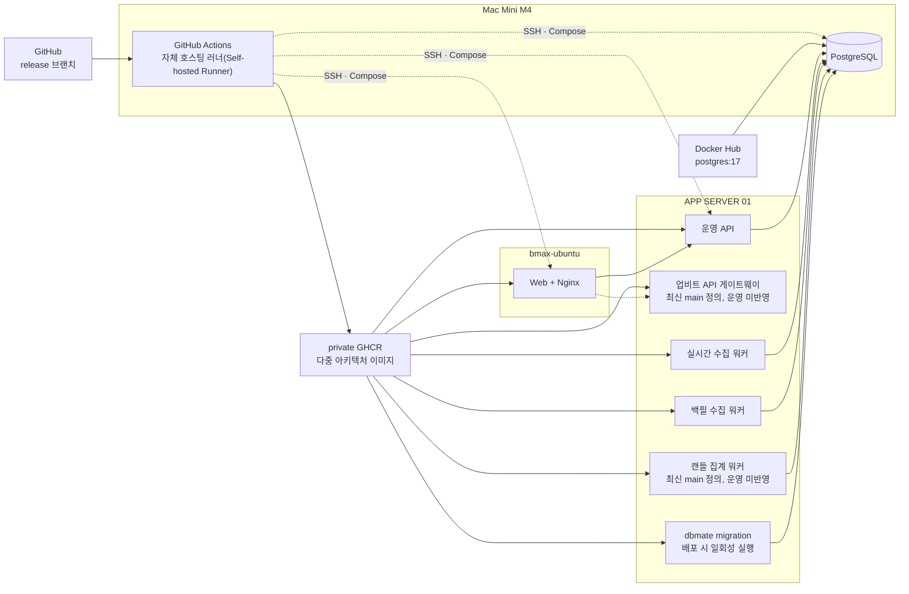
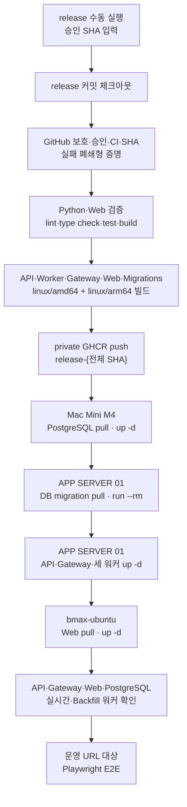

# 운영·배포 개발 사양

상태: 현재
마지막 검증: 2026-07-17 P0 기준선 감사
배포 프로필(Deployment Profile): `prod-home`

## 문서 역할

이 문서는 goodmoneying의 **현재 운영 토폴로지(Topology), 운영계 배포 흐름, 실제 반영 버전과 배포 준비 상태**의 단일 기준(source of truth)이다. 오래 유지되는 배포 결정은 [ADR-0004](ADR/ADR-0004-prod-home-CICD와-배포-프로필.md), 실행 파일과 서버별 환경값은 [prod-home 배포 프로필](../deploy/profiles/prod-home/README.md), 시스템 런타임 책임은 [아키텍처 개발 사양](02_Architecture.md)에서 확인한다.

`마지막 검증` 시각의 현황은 시간이 지나면 달라질 수 있다. 운영 판단 전에는 [현황 재확인 절차](#현황-재확인-절차)를 다시 실행한다.

## 현재 현황 요약

| 항목 | 2026-07-17 P0 감사 결과 | 판단 |
|---|---|---|
| 실제 운영 이미지 | `release-1db7d40`, 원본 커밋 `1db7d4070ca6ef709067b5dea21aa92dd3fa2d73` | API·Web·실시간 수집·백필(Backfill) 수집은 같은 릴리스 태그(Tag)를 사용한다. |
| 마지막 운영 배포 | GitHub Actions `Deploy prod-home` 실행 `28409423876`, 2026-06-30 08:26~08:30 KST, 성공 | 이 실행 이후 새 운영 배포 이력이 없다. |
| 운영 접근 | API `/health` HTTP 200, Web `/` HTTP 200 | Tailscale 내부 URL에서 응답 중이다. |
| 애플리케이션 컨테이너(Container) | API `Up 11 days (healthy)`, 실시간·Backfill 워커 `Up 11 days`, Web `Up 2 weeks` | 현재 실행 중이다. |
| PostgreSQL 접근 | APP SERVER 01의 API 컨테이너에서 `100.107.98.22:5432` TCP 연결 성공 | 애플리케이션 경로의 DB 접근은 가능하다. 현재 점검 장비에서 Mac Mini M4 SSH가 시간 초과되어 PostgreSQL 컨테이너 자체 `pg_isready`는 직접 재검증하지 못했다. |
| 수집 워커 상태 | 실시간·백필 heartbeat 모두 `running`, 각각 1초·0초 전 갱신 | 워커 프로세스뿐 아니라 DB heartbeat도 갱신 중이다. |
| 최근 60초 적재 | 원천 캔들 41, 현재가 47, 호가 86, 체결 679행 | 실시간 데이터 적재가 진행 중이다. |
| `main`과 `release` 차이 | `main` `be28fe9e29ba197ec0bb5e3017ab58b36a6e91f4`, `release` `1db7d4070ca6ef709067b5dea21aa92dd3fa2d73`; `main`이 114커밋 앞서고 `release` 선행 커밋은 0개 | 최근 기능과 배포 변경은 운영에 반영되지 않았다. |
| 최신 `main` CI | 실행 `29519912264`, Browser E2E 1개 실패·15개 통과 | 현재 `main`은 배포 승격(Promotion) 준비 완료 상태가 아니다. |

최신 CI 실패는 Linux 한글 대체 글꼴에서 `조회 개수(count)`가 줄바꿈되어 조회 종료 시각과 입력 y 좌표가 14px 어긋난 것이다. P0 작업 브랜치는 공유 서브그리드(subgrid)와 681·680px/WCAG 텍스트 간격 회귀 테스트로 수정했지만 원격 CI 성공 전에는 `main`을 `release`로 승격하지 않는다.

### 운영 반영과 최신 코드의 차이

현재 운영 `release-1db7d40`에는 다음 세 구성요소가 없다.

- 업비트 API 게이트웨이(Upbit API Gateway)
- 캔들 집계 워커(Candle Aggregation Worker)
- dbmate 기반 배포 전 DB 마이그레이션(Migration)

원격 `main`의 최신 배포 정의에는 위 구성요소가 모두 추가되어 있다. 따라서 “저장소에 구현됨”과 “운영에 배포됨”을 같은 상태로 보지 않는다.

## 운영 토폴로지



운영 서비스와 서버 간 통신은 Tailscale 내부망 전용이다. 외부 공개 도메인과 공인 TLS(Transport Layer Security)는 현재 범위가 아니다.

## 배포 기준과 트리거

- `main` 또는 PR(Pull Request) push는 [CI 워크플로](../.github/workflows/ci.yml)만 실행한다.
- `release` 브랜치 push는 운영 배포를 시작하지 않는다. 보호·승인 설정이 완성되기 전 오배포를 막기 위해 자동 트리거를 제거했다.
- [Deploy prod-home 워크플로](../.github/workflows/deploy.yml)는 보호된 `release` 참조(Ref)에서 수동 실행(`workflow_dispatch`)하고 승인된 40자리 SHA를 입력한다.
- 이미지 build 전에 P8 exact-SHA 배포 잠금, `main`·`release` 보호, `prod` 필수 승인자·보호 브랜치 제한, 두 브랜치·입력·실행 SHA 동일성, 같은 SHA의 CI `verify` 성공을 GitHub API로 증명한다. 보호 조회용 Administration read GitHub App/PAT 환경 비밀값이 없거나 외부 상태가 불명확하면 실패한다.
- 배포 작업은 `deploy-prod-home-v3` 동시성 그룹(Concurrency Group)으로 직렬화한다. migration·부분 배포 중인 실행을 후속 실행이 취소하지 않도록 `cancel-in-progress`는 `false`다.
- 운영 배포는 `prod` GitHub 환경(Environment)과 Mac Mini M4의 `self-hosted`, `mac-mini-m4` 러너 라벨(Label)을 사용한다.

수동 실행은 승인된 현재 `release`를 배포하는 유일한 경로다.

```bash
approved_sha="$(git ls-remote origin refs/heads/release | cut -f1)"
gh workflow run deploy.yml --ref release -f profile=prod-home -f approved_sha="${approved_sha}"
```

`main`에서 `release`로의 승인 승격 자동화, 보호 설정, 백업·복원·전진 복구·확장 health gate는 Issue #34·#35 범위다. 모든 증적을 마친 P8 SHA를 저장소 변수 `GOODMONEYING_PROD_DEPLOY_ENABLE_SHA`에 설정하기 전에는 사전점검이 실패하므로 운영 배포할 수 없다.

## 승인 목표 배포 실행 흐름

이 절은 P0에서 적용한 실패 폐쇄형 배포 파일과 ADR-0015의 승인 목표를 기준으로 한다. 현재 원격 `main`·`release` 보호와 `prod` 필수 승인자가 없으므로 Issue #35가 외부 설정을 완료하기 전에는 사전점검에서 의도적으로 중단된다.



1. 워크플로가 보호·승인·CI·SHA 증명을 통과한 뒤 `release-${GITHUB_SHA}` 전체 40자리 이미지 태그를 만든다.
2. Python 의존성·Node.js 의존성·Playwright Chromium을 준비한다.
3. Ruff 린트(Lint), Mypy 타입 검사(Type Check), Pytest, Vitest, Web 빌드를 순서대로 실행한다. 하나라도 실패하면 이미지 빌드 전 중단한다.
4. Mac Mini M4 로그인 셸에서 API, Worker, Upbit Gateway, Web, Migrations 이미지를 `linux/amd64`, `linux/arm64`로 빌드해 private GHCR에 push한다.
5. [deploy-profile.sh](../deploy/scripts/deploy-profile.sh)가 `infra → app → web` 순서로 서버별 Compose 파일·환경 샘플·제어 스크립트를 복사하고 이미지를 pull한다.
6. app 서비스를 올리기 전에 `migrate` 프로필로 dbmate migration을 실행한다. migration 실패 시 app의 새 버전을 기동하지 않는다.
7. [healthcheck-profile.sh](../deploy/scripts/healthcheck-profile.sh)가 API, Upbit Gateway, Web, PostgreSQL, 실시간 수집 워커, 백필 수집 워커를 확인한다.
8. APP SERVER 01의 운영 토큰을 로그에서 마스킹(Masking)해 Playwright에 전달하고, 운영 API·Web URL 대상으로 자동화된 종단 간 테스트(E2E Test)를 실행한다.

현재 healthcheck는 캔들 집계 워커의 컨테이너 상태와 heartbeat, 실제 데이터 증가량을 확인하지 않는다. 배포 성공은 “배포 워크플로의 정의된 검사 통과”이며, 모든 장기 실행 작업의 데이터 흐름까지 보장한다는 뜻은 아니다.

## 서버별 배포 대상

| 서버 | 배포 루트 | 현재 운영 서비스 | 최신 `main`에서 추가될 서비스 |
|---|---|---|---|
| Mac Mini M4 | `/Users/goodjoon/DATA/applications/goodmoneying` | PostgreSQL, GitHub Actions runner | 새 장기 실행 서비스는 없으며 Migrations 이미지를 빌드하고 배포를 제어 |
| APP SERVER 01 | `/home/goodjoon/project/goodmoneying` | API, 실시간 수집 워커, 백필 수집 워커 | Upbit Gateway, 캔들 집계 워커, 실행 전 dbmate migration |
| bmax-ubuntu | `/home/goodjoon/applications/goodmoneying` | Web + Nginx | 최신 Web 이미지 |

운영 비밀값(Secret)은 저장소에 넣지 않고 각 서버의 `{base}/env/` 아래에서 관리한다. 정확한 파일 경로와 host volume은 [prod-home 배포 프로필](../deploy/profiles/prod-home/README.md)을 따른다.

## 실패와 롤백

### 배포 실패

- 검증·빌드·migration·배포·healthcheck·E2E 중 하나라도 실패하면 GitHub Actions 실행은 실패한다.
- Compose `up -d` 뒤 healthcheck 또는 E2E가 실패해도 이전 이미지로 자동 복구하지 않는다.
- 배포 스크립트는 서버를 `infra → app → web` 순서로 갱신하므로 중간 실패 시 서버별 버전이 일시적으로 다를 수 있다. 각 서버의 `deploy.compose.env`와 실제 컨테이너 이미지 태그를 함께 확인한다.

### 수동 롤백(Rollback)

자동 롤백은 구현되어 있지 않다. 이전 불변 이미지 태그를 다시 배포할 수 있지만 다음 조건을 모두 확인해야 한다.

1. API, Worker, Upbit Gateway, Web, Migrations 등 현재 배포 스크립트가 요구하는 이미지가 해당 태그에 모두 존재한다.
2. 이미 적용된 DB migration과 이전 애플리케이션이 호환된다.
3. 운영 데이터의 되돌릴 수 없는 변경이 없다.
4. 배포 후 healthcheck와 운영 E2E를 다시 실행한다.

```bash
deploy/scripts/deploy-profile.sh prod-home release-<검증한-커밋-SHA>
deploy/scripts/healthcheck-profile.sh prod-home
```

DB migration의 자동 하향 복구(Down Migration)는 현재 배포 흐름에 없다. 따라서 DB 계약이 바뀐 배포의 롤백은 단순 이미지 태그 교체로 처리하지 않는다.

## 현황 재확인 절차

### 1. 원격 브랜치와 최근 실행

```bash
git ls-remote --heads origin main release
gh api repos/goodjoon-company/goodmoneying/compare/release...main \
  --jq '{status, ahead_by, behind_by, total_commits}'
gh run list --workflow ci.yml --branch main --limit 5
gh run list --workflow deploy.yml --branch release --limit 5
```

### 2. 운영 서비스 기본 상태

```bash
GOODMONEYING_HEALTHCHECK_RETRIES=1 \
  GOODMONEYING_HEALTHCHECK_RETRY_INTERVAL_SECONDS=1 \
  deploy/scripts/healthcheck-profile.sh prod-home
```

healthcheck 전체가 실패하면 출력의 첫 실패를 전체 장애로 일반화하지 않는다. API·Web HTTP, 서버별 컨테이너, PostgreSQL, 워커 heartbeat를 나눠 확인한다.

### 3. 실제 배포 태그

```bash
ssh app-server01 \
  "docker ps --format '{{.Names}} {{.Image}} {{.Status}}' --filter 'name=goodmoneying-'"
ssh bmax-ubuntu \
  "docker ps --format '{{.Names}} {{.Image}} {{.Status}}' --filter 'name=goodmoneying-'"
```

서버별 `{base}/deploy.compose.env`의 `GOODMONEYING_IMAGE_TAG`와 `docker ps`의 실제 이미지 태그가 같은지 확인한다.

### 4. 데이터 흐름

컨테이너가 실행 중이라는 사실만으로 수집 정상 여부를 판정하지 않는다. 다음 항목을 함께 본다.

- `collection_worker_heartbeats`의 상태와 `clock_timestamp()` 기준 heartbeat 나이
- `source_candles`, `ticker_snapshots`, `orderbook_summaries`, `trade_events`의 60초 전후 행 수 증가
- 최근 `collection_runs`의 성공·실패
- `backfill_jobs`의 `pending`·`running` 작업과 진행 정체 여부

## 현재 남은 위험과 다음 조치

1. P0 브랜치의 전체 CI 성공과 문서·계약 리뷰를 확인한다.
2. Issue #34에서 운영 DB 백업·복원 rehearsal, 보안·장애 주입과 migration 전진 복구를 증명한다.
3. Issue #35에서 `main`·`release` 보호, `prod` 필수 승인자, 승인 승격, Administration read 배포 자격 증명과 확장 health gate를 구성한다.
4. 모든 gate를 통과한 exact SHA만 P8 enable 변수에 설정하고 `release`와 동일 SHA로 수동 배포한다.
5. 첫 최신 배포에서 Gateway·집계 worker·dbmate migration, 모든 heartbeat·row delta·WebSocket·DB 용량·오류 log·`live_disabled`와 운영 E2E를 확인한다.

## 관련 문서와 증적

- [prod-home CI/CD 결정](ADR/ADR-0004-prod-home-CICD와-배포-프로필.md)
- [prod-home 배포 프로필](../deploy/profiles/prod-home/README.md)
- [최초 prod-home 배포 검증](Test/2026-06-19-M1-prod-home-CICD-배포-검증.md)
- [현재 운영 배포 흐름·현황 문서 검증](Test/2026-07-16-운영-배포-흐름과-현황-문서-검증.md)
- [현재 운영 배포 문서화 이력](History/2026-07-16-운영-배포-흐름과-현황-문서화.md)
- [최근 성공한 운영 배포 실행](https://github.com/goodjoon-company/goodmoneying/actions/runs/28409423876)
- [최신 main CI 실패 실행](https://github.com/goodjoon-company/goodmoneying/actions/runs/29519912264)
