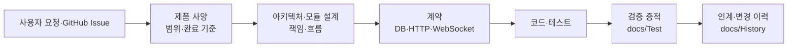

# goodmoneying 개발 사양 문서

이 저장소는 제품, 아키텍처(Architecture), 계약(Contract), 검증, 인계를 서로 다른 단일 기준(source of truth)으로 관리한다. 새 기능을 이해하거나 변경할 때는 같은 내용을 여러 문서에서 찾지 않도록 아래 순서로 읽는다.

## 개발자 읽는 순서

1. [제품 개발 사양](01_Product.md)에서 사용자 가치, 범위, 요구사항 ID, 완료 기준을 확인한다.
2. [아키텍처 개발 사양](02_Architecture.md)에서 시스템 경계, 런타임, 데이터 흐름, 모듈 책임을 확인한다.
3. 관련 [모듈 설계](02_Architecture/)에서 구현 경계와 실패·복구 흐름을 확인한다.
4. [계약 기준](contracts/README.md)에서 DB·HTTP·WebSocket의 기계 검증 파일을 확인한다.
5. [개발·운영 사용 안내](사용설명서-M1-업비트-수집-운영-mvp.md)로 로컬 실행과 화면별 확인 절차를 따른다.
6. 변경 전후 결정은 `ADR/`, 실제 검증은 `Test/`, 인계·리스크는 `History/`, 실행 단위는 GitHub Issue에서 확인한다.

## 문서 책임 지도

| 질문 | 단일 기준 | 포함하는 내용 | 포함하지 않는 내용 |
|---|---|---|---|
| 왜 만들고 무엇을 만족해야 하는가? | `01_Product.md` | 목표, 범위, 요구사항, 정책, 로드맵, 수용 기준 | API 필드·DB 컬럼·구현 로그 |
| 시스템은 어떻게 나뉘고 흐르는가? | `02_Architecture.md`, `02_Architecture/` | 경계, 모듈 책임, Mermaid 다이어그램, 운영·복구 기준 | 기계 검증 스키마 상세 |
| 요청·응답·메시지·저장 형식은 무엇인가? | `contracts/` | OpenAPI, JSON Schema, SQL DDL, 변경 순서 | 제품 우선순위·화면 설명 복제 |
| 어떻게 실행하고 확인하는가? | `사용설명서-*.md`, 루트 `README.md` | 설치, 프로세스 제어, 화면 사용, 장애 확인 | 제품·계약의 재정의 |
| 무엇을 실제로 검증했는가? | `Test/` | 명령, 결과, 수동 확인, 공백 | 장기 설계 결정 |
| 왜 바꾸었고 다음 위험은 무엇인가? | `History/`, `ADR/` | 결정 배경, 변경 요약, 리스크, 후속 작업 | 활성 실행 계획의 복제 |

## 변경 흐름

새 실행 단위는 GitHub Issue에서 시작한다. 인터페이스가 바뀌면 코드보다 계약을 먼저 갱신하고, 검증 증적은 `docs/Test/`, 인계 맥락은 `docs/History/`에 기록한다. `docs/Task/`에는 마일스톤별 완료 작업 요약만 둔다.
